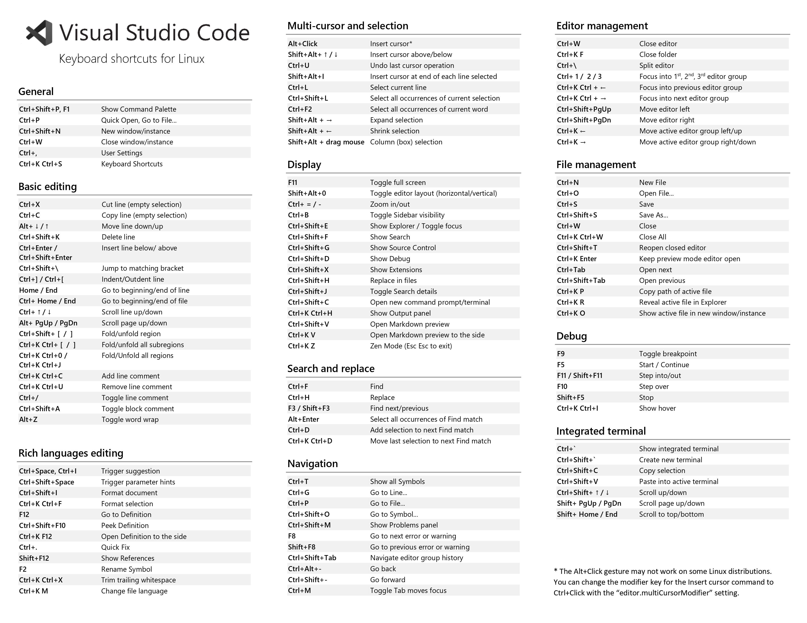
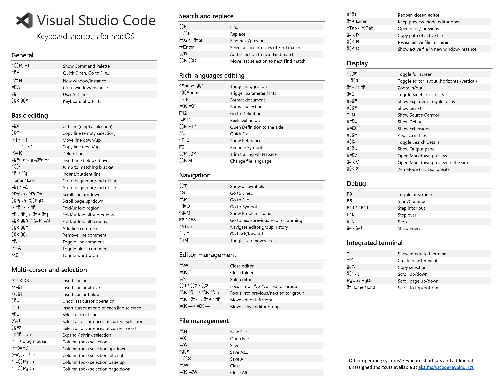

sla utilidade pública (mais para mim mesmo :) )

## Atalhos insanos do Windows

### Atalhos gerais
- `Ctrl+Shift+P`, `F1` Exibe a Paleta de Comandos
- `Ctrl+P` Acesso rápido, Ir para o arquivo…
- `Ctrl+Shift+N` Nova janela/instância
- `Ctrl+Shift+W` Fechar janela/instância
- `Ctrl+,` Configurações do usuário
- `Ctrl+K Ctrl+S` Atalhos do teclado

### Edição básica
- `Ctrl+X` Recortar linha (seleção vazia)
- `Ctrl+C` Copiar linha (seleção vazia)
- `Alt+↑ / ↓` Mover linha para cima/baixo
- `Shift+Alt+↓ / ↑` Copiar linha para baixo/cima
- `Ctrl+Shift+K` Excluir linha
- `Ctrl+Enter` Inserir linha abaixo
- `Ctrl+Shift+Enter` Inserir linha acima
- `Ctrl+Shift+\` Pular para o colchete correspondente
- `Ctrl+] / [` Indentar/recuar linha
- `Home / End` Ir para o início/fim da linha
- `Ctrl+Home` Ir para o início do arquivo
- `Ctrl+End` Ir para o fim do arquivo
- `Ctrl+↑ / ↓` Rolar linha para cima/baixo
- `Alt+PgUp / PgDn` Rolar página para cima/baixo
- `Ctrl+Shift+[` Recolher (colapsar) região
- `Ctrl+Shift+]` Expandir (descolapsar) região
- `Ctrl+K Ctrl+[` Recolher todas as sub-regiões
- `Ctrl+K Ctrl+]` Expandir todas as sub-regiões
- `Ctrl+K Ctrl+0` Recolher todas as regiões
- `Ctrl+K Ctrl+J` Expandir todas as regiões
- `Ctrl+K Ctrl+C` Adicionar comentário na linha
- `Ctrl+K Ctrl+U` Remover comentário da linha
- `Ctrl+/` Alternar comentário de linha
- `Shift+Alt+A` Alternar comentário de bloco
- `Alt+Z` Alternar quebra de linha

### Navegação
- `Ctrl+T` Exibir todos os símbolos
- `Ctrl+G` Ir para a linha...
- `Ctrl+P` Ir para o arquivo...
- `Ctrl+Shift+O` Ir para o símbolo...
- `Ctrl+Shift+M` Exibir painel de problemas
- `F8` Ir para o próximo erro ou aviso
- `Shift+F8` Ir para o erro ou aviso anterior
- `Ctrl+Shift+Tab` Navegar no histórico do grupo de editores
- `Alt+← / →` Voltar / Avançar
- `Ctrl+M` Alternar tabulação movendo o foco

### Busca e substituição
- `Ctrl+F` Buscar
- `Ctrl+H` Substituir
- `F3 / Shift+F3` Buscar próxima/anterior
- `Alt+Enter` Selecionar todas as ocorrências da correspondência de busca
- `Ctrl+D` Adicionar seleção à próxima correspondência de busca
- `Ctrl+K Ctrl+D` Mover última seleção para próxima correspondência de busca
- `Alt+C / R / W` Alternar sensibilidade a maiúsculas / regex / palavra inteira

### Multicursor e seleção
- `Alt+Click` Inserir cursor
- `Ctrl+Alt+↑ / ↓` Inserir cursor acima / abaixo
- `Ctrl+U` Desfazer última operação do cursor
- `Shift+Alt+I` Inserir cursor no final de cada linha selecionada
- `Ctrl+L` Selecionar linha atual
- `Ctrl+Shift+L` Selecionar todas as ocorrências da seleção atual
- `Ctrl+F2` Selecionar todas as ocorrências da palavra atual
- `Shift+Alt+→` Expandir seleção
- `Shift+Alt+←` Reduzir seleção
- `Shift+Alt+(arrastar o mouse)` Seleção em coluna (caixa)
- `Ctrl+Shift+Alt+(seta)` Seleção em coluna (caixa)
- `Ctrl+Shift+Alt+PgUp/PgDn` Seleção em coluna (caixa) página acima/abaixo

### Edição de linguagens avançadas
- `Ctrl+Espaço`, `Ctrl+I` Acionar sugestão
- `Ctrl+Shift+Espaço` Acionar dicas de parâmetro
- `Shift+Alt+F` Formatar documento
- `Ctrl+K Ctrl+F` Formatar seleção
- `F12` Ir para Definição
- `Alt+F12` Espiar Definição
- `Ctrl+K F12` Abrir Definição ao lado
- `Ctrl+.` Correção rápida
- `Shift+F12` Exibir Referências
- `F2` Renomear Símbolo
- `Ctrl+K Ctrl+X` Aparar espaços em branco finais
- `Ctrl+K M` Alterar linguagem do arquivo

### Gerenciamento do editor
- `Ctrl+F4`, `Ctrl+W` Fechar editor
- `Ctrl+K F` Fechar pasta
- `Ctrl+\` Dividir editor
- `Ctrl+1 / 2 / 3` Focar no 1º, 2º ou 3º grupo de editores
- `Ctrl+K Ctrl+←/→` Focar no grupo de editores anterior/próximo
- `Ctrl+Shift+PgUp / PgDn` Mover editor para a esquerda/direita
- `Ctrl+K ← / →` Mover grupo de editores ativo

### Gerenciamento de arquivos
- `Ctrl+N` Novo Arquivo
- `Ctrl+O` Abrir Arquivo...
- `Ctrl+S` Salvar
- `Ctrl+Shift+S` Salvar Como...
- `Ctrl+K S` Salvar Todos
- `Ctrl+F4` Fechar
- `Ctrl+K Ctrl+W` Fechar Todos
- `Ctrl+Shift+T` Reabrir editor fechado
- `Ctrl+K Enter` Manter o editor de visualização aberto
- `Ctrl+Tab` Abrir próximo
- `Ctrl+Shift+Tab` Abrir anterior
- `Ctrl+K P` Copiar caminho do arquivo ativo
- `Ctrl+K R` Revelar arquivo ativo no Explorer
- `Ctrl+K O` Mostrar arquivo ativo em nova janela/instância

### Exibição
- `F11` Alternar tela cheia
- `Shift+Alt+0` Alternar layout do editor (horizontal/vertical)
- `Ctrl+= / -` Zoom in/out
- `Ctrl+B` Alternar visibilidade da Sidebar
- `Ctrl+Shift+E` Mostrar Explorer / Alternar foco
- `Ctrl+Shift+F` Mostrar Busca
- `Ctrl+Shift+G` Mostrar Controle de Versão
- `Ctrl+Shift+D` Mostrar Depuração
- `Ctrl+Shift+X` Mostrar Extensões
- `Ctrl+Shift+H` Substituir nos arquivos
- `Ctrl+Shift+J` Alternar detalhes da Busca
- `Ctrl+Shift+U` Mostrar painel de Saída
- `Ctrl+Shift+V` Abrir visualização de Markdown
- `Ctrl+K V` Abrir visualização de Markdown ao lado
- `Ctrl+K Z` Modo Zen (Esc Esc para sair)

### Depuração
- `F9` Alternar ponto de interrupção
- `F5` Iniciar/Continuar
- `Shift+F5` Parar
- `F11 / Shift+F11` Entrar / Sair de
- `F10` Passar por cima
- `Ctrl+K Ctrl+I` Mostrar hover

### Terminal integrado
- `` Ctrl+` `` Mostrar terminal integrado
- `Ctrl+Shift+` Criar novo terminal
- `Ctrl+C` Copiar seleção
- `Ctrl+V` Colar no terminal ativo
- `Ctrl+↑ / ↓` Rolar para cima/baixo
- `Shift+PgUp / PgDn` Rolar página para cima/baixo
- `Ctrl+Home / End` Rolar para o topo/fim

## Atalhos insanos do Linux

## Atalhos insanos do Mac

(de longe parece um monte de caractere chinês wtfKKKKKKK)
